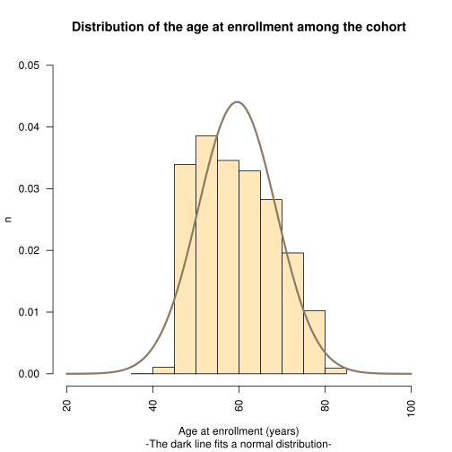
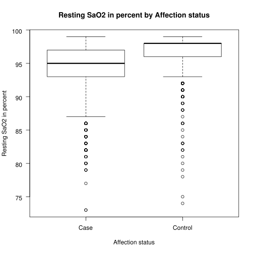

# Case-study: use of PIC-SURE API to extract data from the COPD cohort

## INTRO - Install the required libraries

We install the newly created package picsuRe to facilitate the use of the PIC-SURE API

We also set up the JupyterNB environment


```R
library(devtools)

install_github("hms-dbmi/picsuRe", force = TRUE)
library(picsuRe)
```

    Downloading GitHub repo hms-dbmi/picsuRe@master
    from URL https://api.github.com/repos/hms-dbmi/picsuRe/zipball/master
    Installing picsuRe
    '/opt/conda/lib/R/bin/R' --no-site-file --no-environ --no-save --no-restore  \
      --quiet CMD INSTALL  \
      '/tmp/Rtmp6N7DeP/devtools108d4f3ab7f7/hms-dbmi-picsuRe-cfdda08'  \
      --library='/opt/conda/lib/R/library' --install-tests 
    


```R
httr::set_config(httr::config(ssl_verifypeer = 0L, ssl_verifyhost = 0L, ssl_verifystatus  = 0L))
if (!file.exists(Sys.getenv("TAR")))  Sys.setenv(TAR = "/bin/tar")

install_github("kaz-yos/tableone", force = TRUE)
library(tableone)
    
install.packages("reticulate", repos = "http://cran.r-project.org")
library(reticulate)
```

    Downloading GitHub repo kaz-yos/tableone@master
    from URL https://api.github.com/repos/kaz-yos/tableone/zipball/master
    Installing tableone
    '/opt/conda/lib/R/bin/R' --no-site-file --no-environ --no-save --no-restore  \
      --quiet CMD INSTALL  \
      '/tmp/Rtmp6N7DeP/devtools108db1b8c25/kaz-yos-tableone-48edcec'  \
      --library='/opt/conda/lib/R/library' --install-tests 
    
    Updating HTML index of packages in '.Library'
    Making 'packages.html' ... done


## 1. Data extraction
`environment`: The URL of the environment

`key`: To authenticate with PIC-SURE put your key or token in an otherwise empty text file in your JupyterNotebook's top level folder. The key will be read from there so the key does not get seen by anyone except you.

`variables`: A vector with the variables of interest. You can put a variable, or a path, as you want. You can also use the * key if you want to use a wild card. If an argument corresponds to a node, it will return all the variables below the node


```R
env <- "https://copdgene.hms.harvard.edu"
key <- as.character(read.table("key.csv", sep=",")[1,1])

var1 <- "00 Affection status"
var2 <- "00 Consent groups"
var3 <- "01 Demographics/01 Demographics/Gender"
var4 <- "01 Demographics/Age at enrollment"
var5 <- "01 Demographics/01 Demographics/Race"
var6 <- "03 Clinical data/Respiratory disease form/05 Environmental exposures/01 Cigarette smoking/02 Do you now smoke cigarettes as of one month ago"
var7 <- "Oxygen saturation and therapy/05 Resting SaO2 in percent"


var <- c(var1, var2, var3, var4, var5, var6, var7)
```

With the function `picsure`, we build our query, and get the results back from the API. The output is a dataset with the variables of interests. By default, it will return all the patients that have at least one value for a variable.


```R
system.time(
demo <- picsure(env, key, var, verbose = TRUE)
)
```

    Hi samlp|Laura_Versmee thank you for using picsuRe!
    
    Retrieving the selected pathways:
      Using the "find" function of PICSURE
    
    Retrieving all variables associated with: /00 Affection status
    /i2b2-wildfly-default/Demo/00 Affection status/00 Affection status/Case/
    /i2b2-wildfly-default/Demo/00 Affection status/00 Affection status/Control/
    /i2b2-wildfly-default/Demo/00 Affection status/00 Affection status/Exclusionary Disease/
    /i2b2-wildfly-default/Demo/00 Affection status/00 Affection status/Other/
    
    Retrieving all variables associated with: /00 Consent groups
    /i2b2-wildfly-default/Demo/00 Consent groups/00 Consent groups/DS-LD/
    /i2b2-wildfly-default/Demo/00 Consent groups/00 Consent groups/HMB/
    
    Retrieving all variables associated with: /01 Demographics/01 Demographics/Gender
    /i2b2-wildfly-default/Demo/01 Demographics/01 Demographics/Gender/Female/
    /i2b2-wildfly-default/Demo/01 Demographics/01 Demographics/Gender/Male/
    
    Retrieving all variables associated with: /01 Demographics/Age at enrollment
    /i2b2-wildfly-default/Demo/01 Demographics/01 Demographics/Age at enrollment/
    
    Retrieving all variables associated with: /01 Demographics/01 Demographics/Race
    /i2b2-wildfly-default/Demo/01 Demographics/01 Demographics/Race/African American/
    /i2b2-wildfly-default/Demo/01 Demographics/01 Demographics/Race/Caucasian/
    
    Retrieving all variables associated with: /03 Clinical data/Respiratory disease form/05 Environmental exposures/01 Cigarette smoking/02 Do you now smoke cigarettes as of one month ago
    /i2b2-wildfly-default/Demo/03 Clinical data/03 Clinical data/Respiratory disease form/05 Environmental exposures/01 Cigarette smoking/02 Do you now smoke cigarettes as of one month ago/No/
    /i2b2-wildfly-default/Demo/03 Clinical data/03 Clinical data/Respiratory disease form/05 Environmental exposures/01 Cigarette smoking/02 Do you now smoke cigarettes as of one month ago/Yes/
    
    Retrieving all variables associated with: /Oxygen saturation and therapy/05 Resting SaO2 in percent
    /i2b2-wildfly-default/Demo/03 Clinical data/03 Clinical data/Oxygen saturation and therapy/05 Resting SaO2 in percent/
    
    Building the "where" part of the query
      default subset = "ALL"
      -> will look for all the patients that have a value for at list one of the variable selected
    
    Building the "select" part of the query
    
    Combining the "select" and "where" part of the query to build the json body
    
    Getting a result ID
      -> Query #972
    
    Waiting for PIC-SURE to return the query
      ...still waiting
      ...still waiting
      ...still waiting
      ...still waiting
      ...still waiting
      ...still waiting
      ...still waiting
      ...still waiting
      ...still waiting
      ...still waiting
      ...still waiting
      ...still waiting
      ...still waiting
      ...still waiting
      ...still waiting
      ...still waiting
      ...still waiting
      ...still waiting
      ...still waiting
      ...still waiting
      ...still waiting
      ...still waiting
      ...still waiting
      ...still waiting
      ...still waiting
      ...still waiting
      ...still waiting
      ...still waiting
      ...still waiting
      ...still waiting
      ...still waiting
      ...still waiting
      ...still waiting
      ...still waiting
      ...still waiting
      ...still waiting
      ...still waiting
      ...still waiting
      ...still waiting
      ...still waiting
      ...still waiting
      ...still waiting
      ...still waiting
      ...still waiting
      ...still waiting
      ...still waiting
      ...still waiting
      ...still waiting
      ...still waiting
      ...still waiting
      ...still waiting
      ...still waiting
      ...still waiting
      ...still waiting
      ...still waiting
      ...still waiting
      ...still waiting
      ...still waiting
      ...still waiting
      ...still waiting
      ...still waiting
      ...still waiting
      ...still waiting
      ...still waiting
      ...still waiting
      ...still waiting
      ...still waiting
      ...still waiting
      ...still waiting
      ...still waiting
      ...still waiting
      ...still waiting
      ...still waiting
      ...still waiting
      ...still waiting
      ...still waiting
      ...still waiting
      ...still waiting
      ...still waiting
      ...still waiting
      ...still waiting
      ...still waiting
      ...still waiting
      ...still waiting
      ...still waiting
      ...still waiting
      ...still waiting
      ...still waiting
      ...still waiting
      ...still waiting
      ...still waiting
      ...still waiting
      ...still waiting
      ...still waiting
      ...still waiting
      ...still waiting
      ...still waiting
      ...still waiting
      ...still waiting
      ...still waiting
      ...still waiting
      ...still waiting
      ...still waiting
      ...still waiting
      ...still waiting
      ...still waiting
      ...still waiting
      ...still waiting
      ...still waiting
      ...still waiting
      ...still waiting
      ...still waiting
      ...still waiting
      ...still waiting
      ...still waiting
      ...still waiting
      ...still waiting
      ...still waiting
      ...still waiting
      ...still waiting
      ...still waiting
      ...still waiting
      ...still waiting
      ...still waiting
      ...still waiting
      ...still waiting
      ...still waiting
      ...still waiting
      ...still waiting
      ...still waiting
      ...still waiting
      ...still waiting
      ...still waiting
      ...still waiting
      ...still waiting
      ...still waiting
      ...still waiting
      ...still waiting
      ...still waiting
      ...still waiting
      ...still waiting
      ...still waiting
      ...still waiting
      ...still waiting
      ...still waiting
      ...still waiting
      ...still waiting
      ...still waiting
      ...still waiting
      ...still waiting
      ...still waiting
      ...still waiting
      ...still waiting
      ...still waiting
      ...still waiting
      ...still waiting
      ...still waiting
      ...still waiting
      ...still waiting
      ...still waiting
      ...still waiting
      ...still waiting
      ...still waiting
      ...still waiting
      ...still waiting
      ...still waiting
      ...still waiting
      Result available \o/
    
    Downloading the data frame
    
    Making the dataframe pretty
      ordering the columns according to the order of the variables you selected
      combining the categorical variables
      making the columns' name pretty
    
    The data.frame downloaded contains 10371 observations of 8 variables. Its size is 368.6 Kb


       user  system elapsed 
     24.124   0.354 434.847 


```R
names(demo)[2]<-"Affection_status"
names(demo)[3]<-"Consent_groups"
names(demo)[7]<-"Do_you_now_smoke_cigarettes"
names(demo)[8]<-"Resting_SaO2_in_percent"
```

## 2. Use the data to make statistics
### 2.a. Summary statistics
Let's take a look at the characteristics of our population


```R
catVars <- c("Consent_groups", "Gender", "Affection_status", "Race", "Do_you_now_smoke_cigarettes")
vars <- c("Consent_groups", "Affection_status", "Race", "Do_you_now_smoke_cigarettes", "Age_at_enrollment", "Resting_SaO2_in_percent")

paste("We have", nrow(demo), "patients in our population.")
"Table 1: Description of the population from the COPD Study"
CreateTableOne(vars, data = demo[,-1], factorVars = catVars, strata = c("Gender"), test = FALSE)
```


'We have 10371 patients in our population.'


'Table 1: Description of the population from the COPD Study'


                                           Stratified by Gender
                                            Female        Male         
      n                                      4847          5524        
      Consent_groups = HMB (%)               4725 (97.5)   5374 (97.3) 
      Affection_status (%)                                             
         Case                                1639 (33.8)   2053 (37.2) 
         Control                             2144 (44.2)   2355 (42.6) 
         Exclusionary Disease                  27 ( 0.6)     37 ( 0.7) 
         Other                               1037 (21.4)   1079 (19.5) 
      Race = Caucasian (%)                   3303 (68.1)   3630 (65.7) 
      Do_you_now_smoke_cigarettes = Yes (%)  2424 (50.0)   3013 (54.5) 
      Age_at_enrollment (mean (sd))         59.55 (9.04)  59.60 (9.05) 
      Resting_SaO2_in_percent (mean (sd))   96.15 (3.08)  96.08 (2.85) 


### 2.b. Comparison of a categorical variable with a continuous one. 


```R
Age <- demo$Age_at_enrollment
summary(Age)
hist(Age,
     main="Distribution of the age at enrollment among the cohort",
     sub="-The dark line fits a normal distribution-",
     xlab="Age at enrollment (years)", 
     ylab="n",
     border="black", 
     col="wheat1",
     xlim=c(20,100),
     ylim=c(0,0.05),
     breaks=10,
     las = 2,
     prob = TRUE
    )
m <- mean(Age, na.rm = TRUE)
std <- sqrt(var(Age, na.rm = TRUE))
x <- length(Age)
curve(dnorm(x, mean=m, sd=std), col="wheat4", lwd=3, add=TRUE, yaxt="n")
```


       Min. 1st Qu.  Median    Mean 3rd Qu.    Max. 
      39.90   52.00   58.80   59.58   66.50   85.00 





### 2.c. Comparison of 2 categorical variables. Cases and smokers.


```R
demo <- demo[((demo$Affection_status == "Case" | demo$Affection_status == "Control")
            & (demo$Do_you_now_smoke_cigarettes == "Yes" | demo$Do_you_now_smoke_cigarettes == "No")),]
demo <- droplevels(demo)

Smokers <- demo$Do_you_now_smoke_cigarettes
Cases <- demo$Affection_status

table(Cases, Smokers)
chisq.test(Cases, Smokers)
```


             Smokers
    Cases       No  Yes
      Case    2191 1501
      Control 1878 2621


    
    	Pearson's Chi-squared test with Yates' continuity correction
    
    data:  Cases and Smokers
    X-squared = 250.62, df = 1, p-value < 2.2e-16


### 3.b. Statistical analysis
We can now run a t-test in order to compare the resting SaO2 between case and control


```R
demo2 <- demo[(demo$Affection_status == "Case" | demo$Affection_status == "Control"),]

Resting_SaO2_in_percent <- demo$Resting_SaO2_in_percent
Affection_status <- demo2$Affection_status

summary(Resting_SaO2_in_percent)
t.test(Resting_SaO2_in_percent~Affection_status)
boxplot(Resting_SaO2_in_percent~Affection_status, main="Resting SaO2 in percent by Affection status", xlab="Affection status", ylab="Resting SaO2 in percent",   las = 1)
```


       Min. 1st Qu.  Median    Mean 3rd Qu.    Max.    NA's 
      73.00   95.00   97.00   96.01   98.00   99.00       2 


    
    	Welch Two Sample t-test
    
    data:  Resting_SaO2_in_percent by Affection_status
    t = -36.38, df = 5536.1, p-value < 2.2e-16
    alternative hypothesis: true difference in means is not equal to 0
    95 percent confidence interval:
     -2.525532 -2.267266
    sample estimates:
       mean in group Case mean in group Control 
                 94.69295              97.08935 





```R

```
