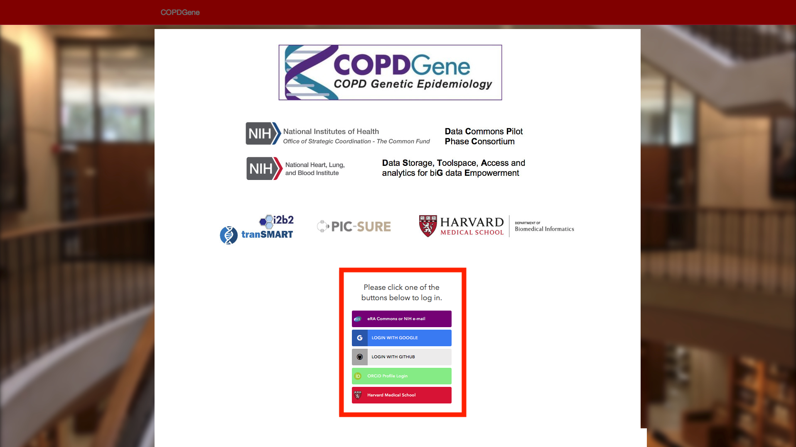
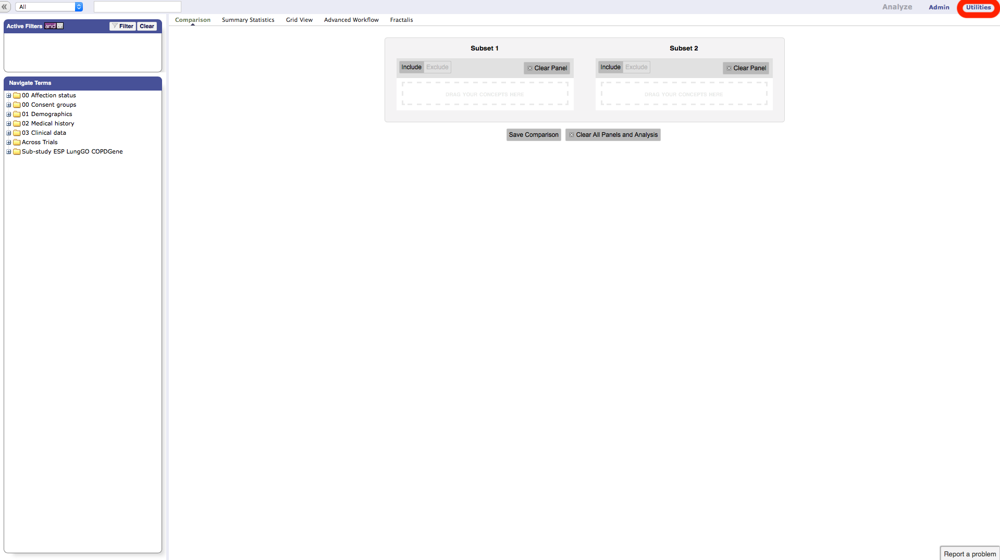
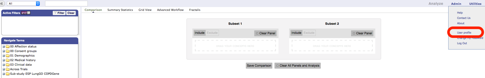
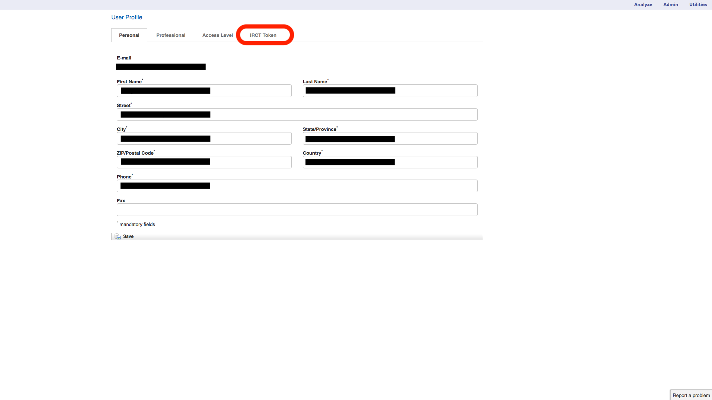
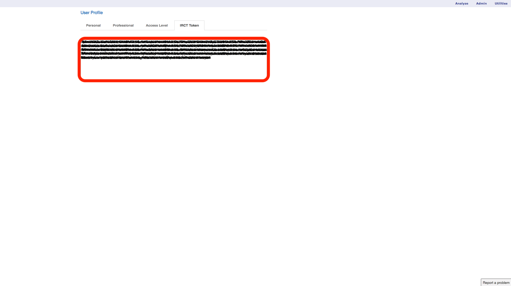

# Tutorial: How to get my i2b2/transmart token
#### 1. Go to https://copdgene.hms.harvard.edu and login with your credentials

#### 3. Click on "Utilities"

#### 4. Click on "User profile"

#### 5. Click on "IRCT Token"

#### 6. Select and copy your token on the pic-sure API environment

